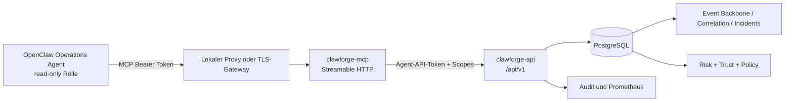

# OpenClaw Live-Integration-Architektur

Clawforge stellt OpenClaw einen isolierten, read-only MCP-Dienst zur Verfügung.
Der MCP-Dienst besitzt keine Datenbankverbindung und greift nicht direkt auf das
Event Backbone, Provider oder die Bewertungsengines zu. Die Agent API v1 ist
der einzige Datenvertrag.

Der MCP-Token authentifiziert den eingehenden OpenClaw-Zugriff. Das MCP-
Ausgangscredential ist ein separater Agent-API-Token und wird ausschließlich
über Docker Secrets oder eine gleichwertige Secret-Injection bereitgestellt.
Tokenwerte stehen weder in Git noch in Konfiguration, Logs, Reports oder
PostgreSQL.

## Read-only Operations-Agent

Der Operations-Agent darf Systemstatus, Events, Incidents, Security Findings,
Trust, Netzwerkdaten, Providerzustand, Context und Decisions lesen. Er darf
Zusammenhänge erklären und Prüfungen empfehlen. Er darf keine Policies,
Provider, Trust Networks, Benutzerrechte oder Incident-Status ändern und keine
Remediation auslösen.

Die minimale produktive Berechtigung umfasst:

- `agent:operations:read`
- `agent:context:read`
- `agent:decision:read`
- `agent:incident:read`
- `agent:provider:read`
- `agent:security:read`

Für System-, Event-, Netzwerk- oder Trust-Abfragen werden zusätzlich die in
`docs/mcp-server.md` dokumentierten Scopes vergeben.

## Beobachtbarkeit

MCP stellt aggregierte Request-, Fehler- und Authentifizierungsmetriken bereit.
OpenClaw liefert pro Agent-Aufruf Toolnamen, Fehlerstatus und Laufzeit. Die
Agent API auditiert die redigierte Ressource und den Agent-Namen. Diese drei
Signale werden gemeinsam verwendet, ohne Credentials oder Rohpayloads zu
speichern.
